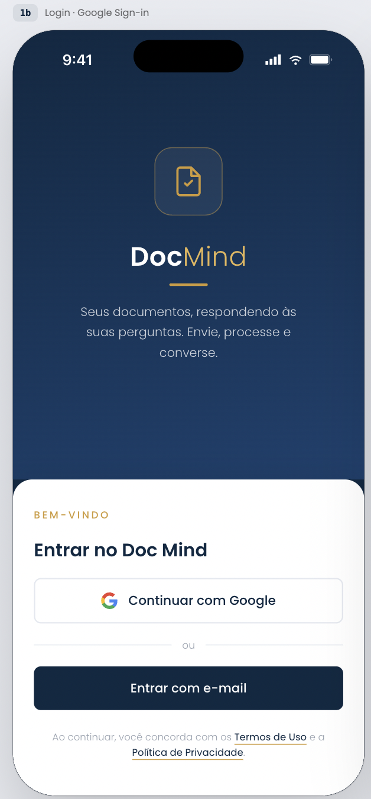
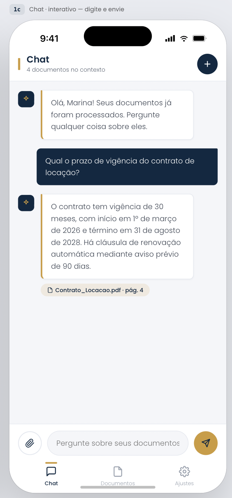
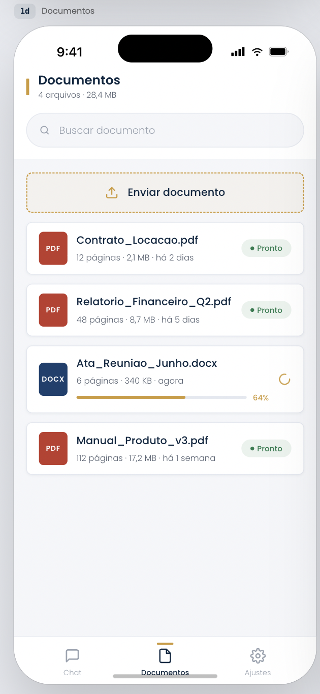
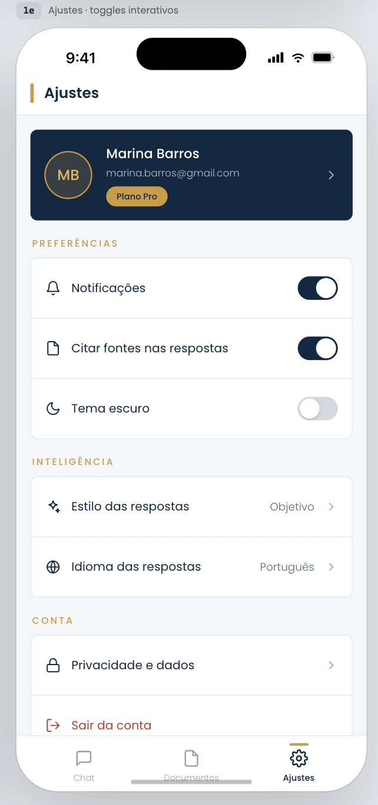

# Doc Mind — App Flutter

App mobile do Doc Mind. A spec completa está em
[`../ref/SPECS/SPEC-FRONTEND.md`](../ref/SPECS/SPEC-FRONTEND.md).

## Rodar

```bash
flutter pub get
flutter pub run build_runner build   # models Freezed e providers Riverpod
flutter run                          # roda com mocks, sem backend
flutter test
flutter analyze
```

Contra o backend real:

```bash
cp env/local.example.json env/local.json   # preencha o Client ID
flutter run --dart-define-from-file=env/local.json
```

No VS Code, escolha **Doc Mind (backend local)** no seletor de execução.
Detalhes e configuração do Google em [SETUP.md](SETUP.md).

A galeria de componentes fica em Ajustes → Desenvolvimento.

## Telas

As imagens abaixo são o **design de referência**, não capturas do app rodando.
Vários elementos nelas não existem no produto — o backend não os suporta. As
diferenças estão listadas em [Divergências entre o design e o
backend](#divergências-entre-o-design-e-o-backend).

| | |
| --- | --- |
|  |  |
| **Login** — `/login`<br>Entrar com Google. "Entrar com e-mail" está no desenho e no app, mas abre um sheet *Em breve*. | **Chat** — `/chat`<br>Pergunta e resposta sobre os documentos. Subtítulo conta `N documentos no contexto`; cada fonte vira chip que abre o PDF na página citada. |
|  |  |
| **Documentos** — `/documents`<br>Lista com busca client-side e upload. No app: só PDF, sem tamanho de arquivo e com barra indeterminada em vez de `64%`. | **Ajustes** — `/settings`<br>No app sobra *Citar fontes nas respostas* (preferência local), sair da conta e a galeria. Plano Pro, notificações e tema escuro não existem. |

Sem mockup, mas implementadas:

| Tela | Rota | O que faz |
| --- | --- | --- |
| **Conversas** | `/chat/conversations` | Histórico empilhado sobre o chat — abrir ou excluir conversa. O backend suporta; o design não desenhou. |
| **Visualizador** | `/documents/viewer/:id` | PDF em tela cheia, abrindo direto na página citada pelo chip. |
| **Galeria** | `/dev/gallery` | Design system: tipografia, botões, chips e cards. Ajustes → Desenvolvimento. |

Três abas em `StatefulShellRoute.indexedStack` (Chat, Documentos, Ajustes);
login, conversas e visualizador ficam fora da tab bar.

## Arquitetura

MVVM por feature, sem Clean Architecture. Cada feature é autocontida:

```
lib/
├── core/            api, config, models, router, services, theme, utils, widgets
└── features/
    ├── auth/        datasources, providers, repositories, services, pages
    ├── chat/        models, viewmodels, widgets, pages
    ├── conversations/
    ├── documents/
    └── settings/
```

**Estado:** Riverpod com `riverpod_generator`. O ViewModel do MVVM *é* a
classe `@riverpod class XViewModel extends _$XViewModel` — não há uma camada
extra sobreposta ao Notifier.

**Navegação:** `go_router` com `StatefulShellRoute.indexedStack`, que preserva
o estado de cada aba. Histórico de conversas e visualizador de PDF são rotas
empilhadas no navigator raiz, cobrindo a tab bar.

**Mock ou HTTP:** a troca acontece no **datasource**, decidida por
`AppConfig.useMocks`. O repositório é classe concreta única — uma só
implementação não justificaria uma interface. Os mocks não foram descartados
na integração: continuam servindo para rodar sem backend e para os testes.

## Divergências entre o design e o backend

O design foi desenhado antes do contrato da API existir. Onde os dois
discordam, o app segue o backend:

| Elemento do design | Situação | Decisão |
| --- | --- | --- |
| Tamanho do arquivo (`2,1 MB`) | `DocumentResponse` não tem o campo | Removido |
| `4 arquivos · 28,4 MB` | idem | Virou `N documentos` |
| Progresso em `64%` | Backend expõe `status`, não percentual | Barra indeterminada |
| Badge `DOCX` | Backend aceita só `application/pdf` (415 no resto) | Badge sempre `PDF` |
| Campo de busca | `GET /documents` não aceita parâmetro de busca | Filtro client-side |
| "Plano Pro" | Não existe no backend | Removido |
| Notificações, tema escuro | Não existem | Removidos |
| Estilo/idioma das respostas | Prompt é fixo no backend | Removidos |
| "Privacidade e dados" | Tela não desenhada | Removido |
| "Citar fontes nas respostas" | `sources` sempre retorna | Virou preferência **local** de exibição |
| Saudação do bot | Não é persistida pela API | Texto de interface |
| Lista de conversas | Backend suporta, design não desenhou | Tela nova, com os componentes do design system |

### Duas exceções deliberadas

1. **"Entrar com e-mail"** continua na tela de login, fiel ao desenho, mas
   abre um sheet informando que ainda não está disponível. Perder o botão
   primário da tela custaria mais que mantê-lo marcado como futuro.
2. **Mensagens de progresso do chat** são cronometradas, não observadas — o
   backend não expõe a etapa do pipeline. Estão marcadas no código como
   encenação, para que ninguém as leia como telemetria.

## Decisões que não são óbvias no código

- **Polling global, não por tela.** O provider de documentos é `keepAlive` e
  faz polling de 2s enquanto houver documento em processamento, parando
  sozinho quando não há. É global porque o subtítulo do chat ("N documentos no
  contexto") consome o mesmo estado, e um upload precisa continuar sendo
  acompanhado depois que o usuário troca de aba. Pausa em segundo plano e
  consulta imediatamente ao voltar.
- **Refresh single-flight.** Se várias requisições receberem 401 juntas, só
  uma chama `/auth/refresh`; as demais aguardam. Sem isso o polling dispararia
  renovações simultâneas e todas menos a primeira falhariam, já que o backend
  invalida o refresh token a cada uso.
- **Conversa criada preguiçosamente.** `POST /conversations` só acontece no
  primeiro envio. Criar ao abrir a aba encheria o histórico de conversas
  vazias. O título é gerado pelo backend a partir da primeira pergunta.
- **Todas as fontes viram chip**, até as cinco do `RETRIEVAL_TOP_K`. Mostrar
  só a de maior score esconderia quatro de cinco e contrariaria o ponto do
  produto. Toque abre o PDF na página; toque longo mostra o trecho e a
  similaridade.
- **Enums toleram valores desconhecidos.** Um `doc_type` novo no backend
  degrada para `unknown` em vez de quebrar o parse e derrubar a tela.

## Testes

56 testes. A seam é única: o **datasource**, injetado via
`ProviderScope(overrides:)`. Ela já existia por necessidade da arquitetura —
não foi criada para testar.

| Arquivo | Cobre |
| --- | --- |
| `models_test.dart` | Parse contra JSON idêntico ao do FastAPI |
| `mock_datasources_test.dart` | Pipeline assíncrono e respostas do chat |
| `documents_page_test.dart` | Lista, busca, polling, divergências do design |
| `chat_page_test.dart` | Envio, fontes, criação preguiçosa, falhas |
| `auth_interceptor_test.dart` | Single-flight, renovação, sessão expirada |
| `auth_flow_test.dart` | Restauração de sessão e logout |
| `widget_test.dart` | Navegação e três viewports (390×844, 1200×900, 800×600) |
